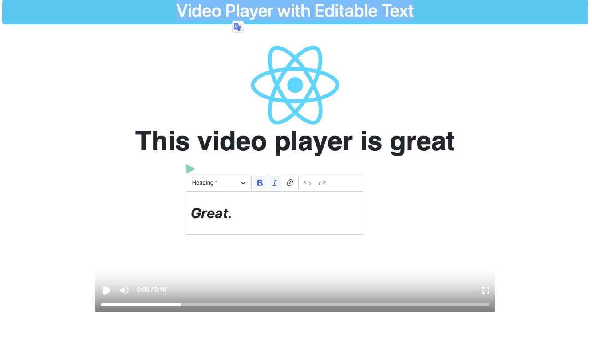

# Video Player with Editable Text with Undo/Redo Functionality

This project is an interactive version of the Remotion Player Example, where you can edit and reposition text fields using a WYSIWYG interface. The difference is that the Remotion Player/Demo is used, and when you edit the text, the video is paused, and you can play it again afterward.

## Features

- Interactive editing and repositioning of text fields on the Remotion Player.
- WYSIWYG interface for making text changes.
- Pausing and playing the video while editing.
- Undo/redo functionality to revert or restore changes.
- Local storage for saving and retrieving user progress.
- Flexible JSON schema to store text and position information.



## Packages

- React
- TypeScript
- Vite
- Bootstrap
- React-Bootstrap
- Remotion
- @remotion/player
- CKEditor
- ESLint
- Prettier

## Installation

To run the application, you need to have Node.js (v16+) installed on your system.

1. Clone the repository.

```sh
https://github.com/mahdifal/remotion-player.git
```

2. Navigate to the project.

```sh
cd project
```

3. Install the dependencies.

```sh
npm install
```

4. Start the development server.

```sh
npm run start
```

5. Open your browser and go to the following link:

```sh
http://localhost:5173/
```

6. For production build:

```sh
npm run build
```

7. To run unit tests:

```sh
npm run test
```

\* Note: If you prefer to use Docker for running the app, use the following command in the terminal:

```sh
docker compose up
```

## Usage

- The Remotion Player will load the example video.
- Text fields will be displayed on the video.
- Click on a text field to select it for editing.
- Use the WYSIWYG interface to make changes to the selected text field.
- To reposition a text field, click and drag it to the desired location on the video.
- The video will be automatically paused when you start editing.
- Click the "Play" button to resume playing the video after editing.
- The editor's progress, including text and position changes, will be saved locally using local storage, allowing it to persist after browser refresh.

### Thanks

Thank you for your consideration
here are my <mehdi.kindly@gmail.com> and [website](https://mahdifalamarzi.vercel.app/).
